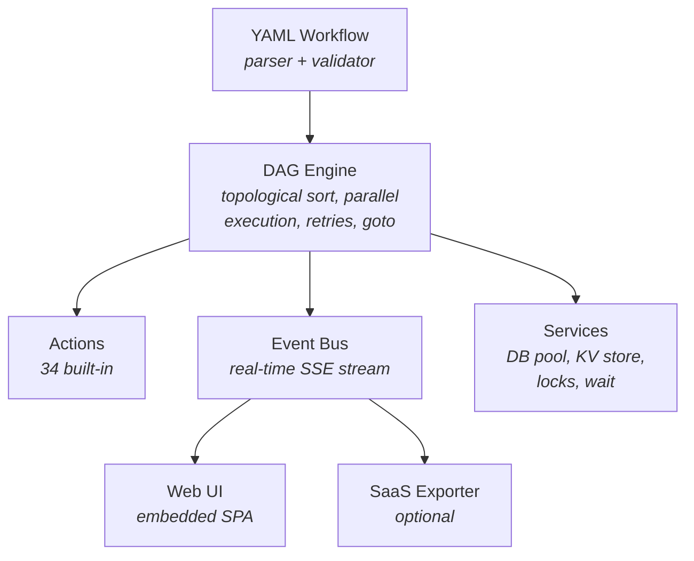

<p align="center">
  <h1 align="center">TailFlow</h1>
  <p align="center">
    <strong>Define your backend logic in YAML. TailFlow runs it.</strong>
  </p>
  <p align="center">
    One binary. Zero infrastructure. 34 built-in actions covering HTTP, SQL, queues, locks, scripting, and sync-over-async webhooks.
  </p>
</p>

<p align="center">
  <a href="https://github.com/tailflowio/tailflow-agent/releases"></a>
  <a href="https://pkg.go.dev/github.com/tailflow/tailflow"></a>
  <a href="https://github.com/tailflowio/tailflow-agent/blob/develop/LICENSE"></a>
  <a href="https://github.com/tailflowio/tailflow-agent"></a>
  <a href="https://github.com/tailflowio/tailflow-agent"></a>
</p>

<p align="center">
  <a href="#quick-start">Quick Start</a> &bull;
  <a href="#use-cases">Use Cases</a> &bull;
  <a href="#actions">Actions</a> &bull;
  <a href="#examples">Examples</a> &bull;
  <a href="#saas-export">SaaS Export</a> &bull;
  <a href="#architecture">Architecture</a>
</p>

---

## Why TailFlow?

Building backends means writing the same patterns over and over: validate input, call an API, wait for a callback, retry on failure, handle transactions, prevent race conditions...

TailFlow lets you express that logic as a **YAML workflow** and handles the rest.

| Problem | Without TailFlow | With TailFlow |
|---------|------------------|---------------|
| Sync-over-async with webhook callback | 200+ lines of Go/Node/Python, custom state machine, webhook server | 30 lines of YAML |
| API endpoint with validation + DB transaction | Controller, service, repository layers, error handling | One YAML file |
| Retry logic with exponential backoff | Custom retry wrapper, error classification | `retry: { max: 3 }` |
| Prevent overselling on concurrent requests | Redis lock implementation, cleanup logic | `action: lock` |
| Shovel messages between RabbitMQ queues | Custom consumer/publisher, ack logic, error handling | `action: rabbitmq.shovel` |

### How it compares

| | TailFlow | Temporal | Airflow | n8n |
|---|----------|----------|---------|-----|
| Infrastructure needed | **None** (single binary) | Cassandra/PostgreSQL cluster | PostgreSQL + Redis + workers | PostgreSQL + Redis |
| Language | YAML + JS expressions | Go/Java/Python SDK | Python DAGs | Visual no-code |
| HTTP triggers | Built-in | Requires custom server | Not designed for it | Limited |
| Sync-over-async (wait for webhook) | Built-in | Manual signal handling | Not supported | Limited |
| SQL transactions | Built-in (begin/commit/rollback) | Manual | Not applicable | Via plugins |
| Web UI | Embedded (zero setup) | Separate deployment | Separate deployment | Built-in |
| SaaS monitoring | Built-in agent exporter | N/A | N/A | N/A |
| Best for | API orchestration, event-driven backends | Long-running distributed workflows | Data pipelines | Simple automations |

---

## Quick Start

### Install

```bash
# From source
go install github.com/tailflow/tailflow/cmd/tailflow@latest

# Or clone and build
git clone https://github.com/tailflow/tailflow.git
cd tailflow && make build
```

### Docker

```bash
# Build the image
make docker-build

# Or directly
docker build -f build/package/Dockerfile -t tailflow:dev .
```

### Run a workflow

```bash
# CLI mode - run and exit
tailflow run examples/hello.yaml -p name=World

# Server mode - embedded UI + API + triggers
tailflow serve examples/sync-callback.yaml --port 8080

# Unsafe mode - disables the default allowlist, enables exec, js, file.* actions
tailflow serve --unsafe examples/ping.yaml
```

### `.env` support

TailFlow automatically loads a `.env` file from the working directory at startup. No wrapper or manual `source` needed.

```bash
# .env
DATABASE_URL=postgres://localhost/mydb
SLACK_WEBHOOK=https://hooks.slack.com/xxx
```

Variables from `.env` are available via `{{ env.DATABASE_URL }}` in your workflows. Environment variables already set in your shell take precedence over `.env` values.

**Priority (highest to lowest):**
1. CLI flags
2. Shell environment (`export X=...`)
3. `.env` file
4. Workflow defaults

### Your first workflow

```yaml
version: "2.0"
name: "hello-world"
description: "A simple hello world workflow"
revision: "1.0.0"

params:
  - name: name
    type: string
    default: "World"

steps:
  - id: greet
    action: log
    title: "Say hello"
    config:
      message: "Hello, {{ params.name }}!"
```

---

## Use Cases

### 1. Sync-over-Async (Webhook Callback)

Submit a document to an external OCR service, **wait for the callback**, then respond to the client - all in one synchronous HTTP request.

```yaml
version: "2.0"
name: "sync-callback"
trigger:
  http:
    method: POST
    path: /ocr/submit

steps:
  - id: validate
    action: js
    config:
      script: |
        if (!trigger.body.document_url) throw new Error("document_url is required");
        return { request_id: "ocr_" + Date.now(), document_url: trigger.body.document_url };

  - id: send-to-provider
    action: http
    depends_on: [validate]
    config:
      method: POST
      url: "https://ocr-provider.com/process"
      body:
        document_url: "{{ steps.validate.output.document_url }}"
        callback_url: "{{ env.BASE_URL }}/api/wait/{{ execution.id }}/ocr-callback"

  - id: wait-result
    action: wait.webhook
    depends_on: [send-to-provider]
    config:
      path: /ocr-callback
      timeout: 5m

  - id: respond
    action: response
    depends_on: [wait-result]
    config:
      status: 200
      body:
        request_id: "{{ steps.validate.output.request_id }}"
        ocr_text: "{{ steps.wait-result.output.body.text }}"
```

**What happens:** Client POSTs to `/pay` -> workflow calls provider -> **pauses and waits** for provider to call back -> responds to the original client request. Zero polling, zero state machine.

### 2. API Backend with SQL Transactions

Build a complete API endpoint with ACID guarantees:

```yaml
version: "2.0"
name: "create-order"
trigger:
  http:
    method: POST
    path: /api/public/orders

steps:
  - id: begin
    action: sql.begin
    config:
      dsn: "{{ env.DATABASE_URL }}"
      name: "order_tx"

  - id: insert_order
    action: sql.exec
    depends_on: [begin]
    config:
      tx: "order_tx"
      query: "INSERT INTO orders (customer_id, total) VALUES ($1, $2) RETURNING id"
      params: ["{{ trigger.body.customer_id }}", "{{ trigger.body.total }}"]
    on_error:
      goto: rollback

  - id: commit
    action: sql.commit
    depends_on: [insert_order]
    config:
      name: "order_tx"

  - id: respond
    action: response
    depends_on: [commit]
    config:
      status: 201
      body:
        order_id: "{{ steps.insert_order.output.last_insert_id }}"

  - id: rollback
    action: sql.rollback
    config:
      name: "order_tx"
```

### 3. Race Condition Prevention

Distributed locks prevent concurrent requests from overselling stock:

```yaml
steps:
  - id: acquire
    action: lock
    config:
      key: "stock-{{ trigger.body.sku }}"
      timeout: "10s"

  - id: check-stock
    action: kv.get
    depends_on: [acquire]
    config:
      key: "stock:{{ trigger.body.sku }}"

  - id: release
    action: unlock
    depends_on: [check-stock]
    config:
      key: "stock-{{ trigger.body.sku }}"
```

### 4. Scheduled Monitoring

Cron-triggered workflows for periodic tasks:

```yaml
version: "2.0"
name: "healthcheck"
revision: "1.0.0"
trigger:
  schedule:
    cron: "*/5 * * * *"

steps:
  - id: check
    action: http
    config:
      method: GET
      url: "https://myapp.com/health"
      timeout: 10s
    retry:
      max: 3

  - id: alert
    action: http
    depends_on: [check]
    when: "steps.check.output.status != 200"
    config:
      method: POST
      url: "{{ env.SLACK_WEBHOOK }}"
      body:
        text: "Healthcheck failed!"
```

### 5. RabbitMQ Event Processing

Process messages from a queue with automatic ack/nack:

```yaml
version: "2.0"
name: "order-processor"
trigger:
  rabbitmq:
    url: "{{ env.RABBITMQ_URL }}"
    queue: "orders"
    prefetch: 5
    ack_on_success: true

steps:
  - id: process
    action: http
    config:
      method: POST
      url: "https://api.internal/process-order"
      body: "{{ trigger.body }}"
```

### 6. RabbitMQ Shovel

Forward messages between queues with per-message safety via native AMQP:

```yaml
steps:
  - id: shovel
    action: rabbitmq.shovel
    config:
      source_url: "{{ env.RABBITMQ_SOURCE }}"
      source_queue: "incoming"
      dest_url: "{{ env.RABBITMQ_DEST }}"
      dest_exchange: "processed"
      dest_routing_key: "orders"
      count: 100
      timeout: 30s
```

### 7. DevOps Automation

Multi-step deployment with conditional rollback:

```yaml
steps:
  - id: build
    action: exec
    config:
      command: "docker build -t myapp:{{ params.version }} ."

  - id: test
    action: exec
    depends_on: [build]
    config:
      command: "docker run myapp:{{ params.version }} npm test"
    retry:
      max: 2

  - id: deploy
    action: exec
    depends_on: [test]
    config:
      command: "kubectl set image deployment/myapp app=myapp:{{ params.version }}"
```

---

## Actions

TailFlow ships with **34 built-in actions**:

| Category | Actions | Description |
|----------|---------|-------------|
| **Core** | `set`, `log`, `response` | Variables, logging, HTTP responses |
| **Scripting** | `js`, `template` | JavaScript (ES6 via Goja) execution, template rendering |
| **Control** | `condition`, `loop`, `delay`, `schedule` | Branching, iteration, waiting, one-shot deferred execution (the `schedule` action is one-shot via `delay`/`at`, distinct from the recurring `schedule` cron trigger below) |
| **HTTP** | `http` | REST calls with full control (headers, auth, retries) |
| **Database** | `sql.query`, `sql.exec`, `sql.begin`, `sql.commit`, `sql.rollback` | Full SQL with ACID transactions |
| **Data** | `json.decode`, `json.encode`, `validate` | Data transformation and validation |
| **Files** | `file.read`, `file.write` | Filesystem operations (self-hosted only) |
| **Strings** | `string.match_all`, `string.replace` | Regex matching and replacement |
| **Math** | `math` | Arithmetic operations |
| **Arrays** | `array.sort`, `array.filter`, `array.map`, `array.uniq`, `array.pick`, `array.concat` | Sorting, filtering, mapping, deduplication, selection, concatenation |
| **Objects** | `object` | Object creation and manipulation |
| **Hash** | `hash` | Hashing (MD5, SHA256, etc.) |
| **KV Store** | `kv.get`, `kv.set`, `kv.delete` | Key-value storage (in-memory or Redis) |
| **Async** | `wait.webhook`, `wait.rabbitmq` | Pause workflow until external event |
| **Concurrency** | `lock`, `unlock` | Distributed locking |
| **Messaging** | `rabbitmq.shovel` | RabbitMQ message forwarding via native AMQP |
| **System** | `exec` | Shell command execution (self-hosted only) |

### Step features

```yaml
- id: my-step
  action: http
  title: "Call external API"
  depends_on: [previous-step]       # DAG dependencies
  when: "vars.should_call == true"  # Conditional execution
  timeout: 30s                      # Per-step timeout
  error_policy: continue            # stop (default), continue, or ignore
  retry:
    max: 3                          # Retry with exponential backoff
    delay: 2s                       # Initial retry delay
  config:
    url: "https://api.example.com"
  on_error:                         # Error handler steps
    - id: log-error
      action: log
      config:
        message: "API call failed: {{ steps.my-step.error }}"
  goto:                             # Conditional loops
    target: my-step
    when: "steps.my-step.output.status == 'retry'"
    max_iterations: 5
  testing:                          # Inline test cases (tailflow test)
    - name: "happy-path"
      output:                       # Mock: skip execution, inject output
        order_id: 42
    - name: "api-down"
      error:                        # Mock error: inject failure
        message: "connection refused"
    - name: "verify-result"
      expect:                       # Assertion: run normally, then verify
        status: "success"
        output:
          order_id: 42
```

---

## Triggers

TailFlow supports 4 trigger types:

| Trigger | Description | Example |
|---------|-------------|---------|
| **HTTP** | Expose workflow as REST endpoint | `trigger: { http: { method: POST, path: /api, async: false } }` |
| **Webhook** | Listen for incoming webhooks with optional HMAC validation and filtering | `trigger: { webhook: { path: /hook, secret: "...", filter: "..." } }` |
| **Schedule** | Cron-based recurring execution (distinct from the one-shot `schedule` action, which defers a single run via `delay`/`at`) | `trigger: { schedule: { cron: "*/5 * * * *" } }` |
| **RabbitMQ** | Process messages from a queue | `trigger: { rabbitmq: { url: "...", queue: "orders" } }` |

---

## Examples

The [`examples/`](./examples) directory contains ready-to-run workflows:

| Example | Description | Key Features |
|---------|-------------|--------------|
| [`hello.yaml`](./examples/hello.yaml) | Hello world | Parameters, variables |
| [`ping.yaml`](./examples/ping.yaml) | Ping a host | Exec, streaming output |
| [`api-trigger.yaml`](./examples/api-trigger.yaml) | REST API endpoint | HTTP trigger, JS validation, response |
| [`sync-callback.yaml`](./examples/sync-callback.yaml) | Sync-over-async | wait.webhook, JS, response |
| [`async-trigger.yaml`](./examples/async-trigger.yaml) | Async background job | async: true HTTP trigger, 202, kv.set |
| [`webhook-trigger.yaml`](./examples/webhook-trigger.yaml) | Webhook with HMAC | Webhook trigger, secret, filter |
| [`sql-transaction.yaml`](./examples/sql-transaction.yaml) | SQL transactions | Begin, insert, commit, rollback on error |
| [`sql-users.yaml`](./examples/sql-users.yaml) | User CRUD | SQL queries, HTTP response |
| [`lock-unlock.yaml`](./examples/lock-unlock.yaml) | Distributed locking | lock/unlock, kv.get/set, condition, when |
| [`testing-demo.yaml`](./examples/testing-demo.yaml) | Inline testing | testing field: mock output, mock error, expect |
| [`sensitive-fields.yaml`](./examples/sensitive-fields.yaml) | Sensitive masking | sensitive field, token redaction |
| [`js-workflow.yaml`](./examples/js-workflow.yaml) | JavaScript scripting | ES6 via Goja, computed values |
| [`loop.yaml`](./examples/loop.yaml) | List iteration | Loop action with pipeline |
| [`goto.yaml`](./examples/goto.yaml) | Conditional loops | Goto with max iterations |
| [`validate-input.yaml`](./examples/validate-input.yaml) | Schema validation | Input validation rules |
| [`parallel-exec.yaml`](./examples/parallel-exec.yaml) | Parallel execution | DAG parallelism |
| [`error-handling-demo.yaml`](./examples/error-handling-demo.yaml) | Error handling | on_error, error_policy, retry |
| [`healthcheck.yaml`](./examples/healthcheck.yaml) | Health monitoring | Cron trigger, HTTP checks, retry |
| [`order-rabbitmq.yaml`](./examples/order-rabbitmq.yaml) | RabbitMQ processing | Queue consumer, wait.rabbitmq |
| [`deploy.yaml`](./examples/deploy.yaml) | Deployment pipeline | Multi-step exec |
| [`rabbitmq-shovel.yaml`](./examples/rabbitmq-shovel.yaml) | RabbitMQ shovel | Native AMQP message forwarding |
| [`data-transform.yaml`](./examples/data-transform.yaml) | Data transformation | json.encode/decode, template, object, math |
| [`array-operations.yaml`](./examples/array-operations.yaml) | Array manipulation | sort, filter, map, uniq, pick, concat |
| [`string-hash.yaml`](./examples/string-hash.yaml) | String & hashing | string.match_all, string.replace, hash |
| [`kv-store.yaml`](./examples/kv-store.yaml) | Key-value store | kv.get, kv.set, kv.delete, condition |
| [`file-operations.yaml`](./examples/file-operations.yaml) | File read/write | file.read, file.write (self-hosted) |
| [`delay-schedule.yaml`](./examples/delay-schedule.yaml) | Timed workflows | delay, schedule |

---

## Architecture



### Key design decisions

- **Single binary**: The web UI is embedded. No Node.js, no Docker, no external services required.
- **DAG execution**: Steps run in parallel when dependencies allow. Semaphore limits concurrency to CPU count.
- **Event-driven**: Every step emits events streamed via SSE to the UI in real-time.
- **Non-blocking export**: The SaaS exporter runs independently. Failures never affect local execution.
- **Extensible services**: Interfaces for `Locker`, `DBPool`, `KVStore` allow plugging in Redis/PostgreSQL for multi-instance deployments.

---

## CLI Reference

### `tailflow run`

Execute a workflow in CLI mode (run and exit).

```bash
tailflow run <workflow.yaml> [flags]
```

| Flag | Description |
|------|-------------|
| `--param, -p` | Parameters as key=value (repeatable) |
| `--data, -d` | Trigger body as JSON string |

### `tailflow serve`

Start the web server with embedded UI, API, and triggers.

```bash
tailflow serve <workflow.yaml> [flags]
```

| Flag | Default | Description |
|------|---------|-------------|
| `--port, -P` | `8080` | Server port |
| `--max-executions` | `100` | Max executions kept in memory |
| `--unsafe` | `false` | Disable the default allowlist: enable exec, js, file.* actions |

### `tailflow validate`

Validate a workflow file without executing it.

```bash
tailflow validate <workflow.yaml>
```

### `tailflow test`

Run inline test cases defined in workflow steps.

```bash
# Run all test cases
tailflow test <workflow.yaml>

# Run a specific test case
tailflow test <workflow.yaml> --case happy-path

# List all test cases as a matrix
tailflow test <workflow.yaml> --list
```

| Flag | Description |
|------|-------------|
| `--case` | Run a specific test case by name |
| `--list` | Display the test case matrix (steps vs cases) |

When no `--case` is specified, all cases are executed and a summary is printed:

```
Testing "my-workflow"...

  happy-path           ✓ passed (45ms)
  api-down             ✓ passed (12ms)

2/2 passed
```

### Global flags

| Flag | Env variable | Description |
|------|-------------|-------------|
| `--no-color` | | Disable colour output |
| `--otel-endpoint` | `OTEL_EXPORTER_OTLP_ENDPOINT` | OTLP/HTTP endpoint |
| `--otel-service-name` | `OTEL_SERVICE_NAME` | Service name (default: tailflow) |

### API Endpoints

| Method | Path | Description |
|--------|------|-------------|
| `GET` | `/api/workflow` | Get workflow definition |
| `GET` | `/api/workflow/graph` | Get workflow DAG graph |
| `GET` | `/api/workflow/activity` | Get execution activity history |
| `GET` | `/api/workflow/steps/{id}` | Get step detail |
| `POST` | `/api/workflow/run` | Trigger workflow execution |
| `POST` | `/api/workflow/validate` | Validate workflow |
| `GET` | `/api/executions` | List all executions |
| `GET` | `/api/executions/{id}` | Get execution details |
| `POST` | `/api/executions/{id}/cancel` | Cancel running execution |
| `GET` | `/api/executions/{id}/events` | SSE stream for execution |
| `GET` | `/api/events` | Global SSE stream |
| `GET` | `/api/metrics` | Workflow metrics |

---

## Workflow DSL Reference

```yaml
version: "2.0"                    # Required - schema version
name: "my-workflow"               # Workflow name
description: "What it does"       # Optional
revision: "1.0.0"                 # Optional - workflow version (semver, int, git hash...)
tags: ["api", "automation"]       # Optional - for categorization
author: "team-name"               # Optional

params:                           # Input parameters
  - name: user_id
    type: string                  # string, int, float, bool
    required: true
    pattern: "[a-zA-Z0-9_-]+"    # Optional regex validation (security)
  - name: dry_run
    type: bool
    default: false

env:                              # Environment variables (template interpolation)
  DATABASE_URL: "{{ env.DB_URL }}"

trigger:                          # Trigger (server mode only)
  http:                           # HTTP endpoint
    method: POST
    path: /my-endpoint
    async: false                  # true = return 202 immediately
  # OR
  webhook:                        # Webhook listener
    path: /hook
    secret: "my-secret"           # Optional HMAC validation
    filter: "body.type == 'order'" # Optional JS filter expression
  # OR
  schedule:                       # Recurring cron trigger (distinct from the one-shot `schedule` action)
    cron: "*/5 * * * *"
  # OR
  rabbitmq:                       # RabbitMQ consumer
    url: "{{ env.RABBITMQ_URL }}"
    queue: "orders"
    prefetch: 10
    ack_on_success: true

on_error:                         # Workflow-level error handler
  - id: notify-failure
    action: http
    config:
      method: POST
      url: "{{ env.SLACK_WEBHOOK }}"
      body:
        text: "Workflow failed: {{ error }}"

steps:                            # Workflow steps (DAG)
  - id: step-id                   # Unique step identifier
    action: action-name           # One of 34 built-in actions
    title: "Human-readable title"
    depends_on: [other-step]      # DAG dependencies
    when: "expression"            # Skip condition
    timeout: 30s                  # Step timeout
    error_policy: continue        # stop (default), continue, or ignore
    retry:
      max: 3                      # Retry count
      delay: 2s                   # Initial retry delay
    config:                       # Action-specific configuration
      key: "value"
    on_error:                     # Error handler sub-steps
      - id: handle-error
        action: log
    goto:                         # Conditional jump (loops)
      target: step-id
      when: "expression"
      max_iterations: 10
    testing:                      # Inline test cases (tailflow test)
      - name: "case-name"
        output: { ... }           # Mock output (skip execution)
        error:                    # Mock error (skip execution)
          message: "..."
          code: "..."
        expect:                   # Assertion (verify after execution)
          status: "success"
          output: { ... }         # Partial deep match
          error:
            message: "..."
            code: "..."
```

### Inline Testing

Define test cases directly in your workflow steps. When running `tailflow test`, steps with a matching case name get their action skipped and output/error mocked. Steps without a matching case execute normally with data cascading from the DAG.

**Three modes:**

| Mode | Fields | Behavior |
|------|--------|----------|
| **Mock output** | `output` only | Skip execution, inject output |
| **Mock error** | `error` only | Skip execution, inject error (respects `error_policy`) |
| **Assertion** | `expect` only | Execute normally, then verify result (partial deep match) |
| **Mock + Assert** | `output` + `expect` | Inject output AND verify it matches expectations |

**Partial deep match:** The `expect.output` check is partial — your expected map only needs to contain the keys you care about. The actual output can have extra keys.

```yaml
steps:
  - id: fetch-user
    action: http
    config:
      url: "https://api.example.com/users/1"
    testing:
      - name: "happy-path"
        output:
          id: 1
          name: "Alice"
          email: "alice@example.com"

      - name: "not-found"
        error:
          message: "user not found"
          code: "not_found"

      - name: "check-format"
        expect:
          status: "success"
          output:
            id: 1

  - id: greet
    action: log
    depends_on: [fetch-user]
    config:
      message: "Hello, {{ steps.fetch-user.output.name }}!"
```

```bash
tailflow test workflow.yaml --list
#                     fetch-user        greet
#   happy-path        mock              (runs)
#   not-found         mock error        (runs)
#   check-format      expect            (runs)

tailflow test workflow.yaml --case happy-path
# fetch-user is mocked → greet runs with mocked data

tailflow test workflow.yaml
# Runs all 3 cases, prints summary
```

### Sensitive Fields

Declare sensitive key names at the workflow top-level to automatically mask their values in all external outputs (SSE events, SaaS exporter, REST API). Internal step-to-step resolution keeps the real values.

```yaml
version: "2.0"
name: "sensitive-fields"

sensitive:
  - access_token
  - refresh_token
  - client_secret

params:
  - name: api_key
    type: string

steps:
  - id: auth
    action: http
    config:
      url: "https://api.example.com/auth"
```

Any key matching a name in the `sensitive` list is replaced with `[SENSITIVE]` **recursively** — at any depth, in params, step outputs, and configs — across all external channels. Steps still receive the real values via template resolution (`{{ steps.auth.output.token }}`).

### Template expressions

Access runtime data in any config value:

| Expression | Description |
|------------|-------------|
| `{{ params.name }}` | Input parameter |
| `{{ env.DATABASE_URL }}` | Environment variable |
| `{{ vars.counter }}` | Workflow variable (set by `set` action) |
| `{{ steps.step_id.output }}` | Step output |
| `{{ steps.step_id.output.field }}` | Nested step output |
| `{{ trigger.body }}` | HTTP trigger request body |
| `{{ trigger.headers }}` | HTTP trigger headers |
| `{{ trigger.query }}` | HTTP trigger query params |
| `{{ execution.id }}` | Current execution ID |

### Built-in functions

| Function | Description | Example |
|----------|-------------|---------|
| `uuid()` | Generate a UUID v4 | `{{ uuid() }}` |
| `now()` | Current time (RFC3339, UTC) | `{{ now() }}` |
| `now("tz")` | Current time in timezone | `{{ now("Europe/Paris") }}` |
| `tz(date, "tz")` | Convert date to timezone | `{{ tz(now(), "Asia/Tokyo") }}` |
| `formatDate(date, fmt)` | Format a date | `{{ formatDate(now(), "date") }}` |
| `addDate(date, dur)` | Add duration to date | `{{ addDate(now(), "2h") }}` |
| `diffDate(d1, d2)` | Difference in seconds | `{{ diffDate(d1, d2) }}` |
| `unixTime()` | Current unix timestamp | `{{ unixTime() }}` |
| `flag(name, val)` | CLI flag with value (empty if val is empty) | `{{ flag("--id", params.id) }}` |
| `bflag(name, bool)` | Boolean CLI flag (empty if false) | `{{ bflag("-v", params.verbose) }}` |

**CLI flag helpers** - Build dynamic commands with optional arguments:

```yaml
params:
  - name: id
    type: string
    default: ""
  - name: verbose
    type: bool
    default: false

steps:
  - id: run
    action: exec
    config:
      command: "mytool {{ bflag('-v', params.verbose) }} {{ flag('--id', params.id) }}"
      # {"verbose": true, "id": "42"} → "mytool -v --id 42"
      # {}                             → "mytool"
```

### Parameter validation

Use the `pattern` field to validate parameters with a regex before execution. This prevents injection attacks when parameters are interpolated into commands:

```yaml
params:
  - name: host
    type: string
    required: true
    default: "google.fr"
    pattern: "[a-zA-Z0-9._-]+"   # blocks "google.fr && rm -rf /"
```

If a value doesn't match the pattern, the workflow fails immediately with a clear error message.

---

## Project Structure

```
tailflow/
├── cmd/tailflow/          # CLI entry point
├── internal/
│   ├── action/            # 34 action implementations
│   ├── engine/            # DAG execution engine
│   ├── event/             # Event bus (SSE streaming)
│   ├── parser/            # YAML workflow parser
│   ├── runtime/           # Expression evaluation, services
│   ├── server/            # HTTP server, API handlers
│   ├── trigger/           # Trigger implementations
│   ├── store/             # Execution storage
│   ├── lock/              # Distributed locking
│   └── metrics/           # Metrics collection
├── pkg/                   # Public library packages
├── web/frontend/          # Vue.js embedded UI
├── examples/              # Ready-to-run workflow examples
├── scripts/               # Build and utility scripts
└── build/package/         # Dockerfile
```

## Development

```bash
# Build (with embedded frontend)
make build

# Build (Go only, faster)
make build-quick

# Run tests
make test

# Run tests with coverage
make test-coverage

# Lint
make lint

# Generate mocks
make gen-mocks

# Build frontend (requires Node.js)
cd web/frontend && npm install && npm run build

# Build Docker image
make docker-build
```

---

## Built with AI

TailFlow is a solo project where I wear the architect and tech lead hat: I define the vision, design the architecture, write the specs, and decide every technical trade-off.

AI (Claude) acts as my team. I give it precise tasks, constraints, and acceptance criteria — the same way I would brief engineers on a team. It writes code, tests, docs, and refactors under my direction. Every line is reviewed and validated by me before it ships.

This workflow lets a single person ship what would normally require a small team, without compromising on code quality or architecture. The decisions are mine. The execution is accelerated.

**In practice:** I architect, AI implements, I review. That's the loop.

---

## License

[Apache 2.0](LICENSE)
